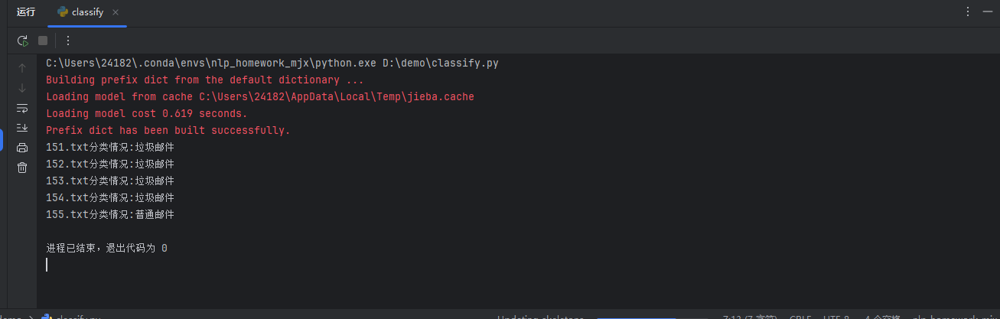
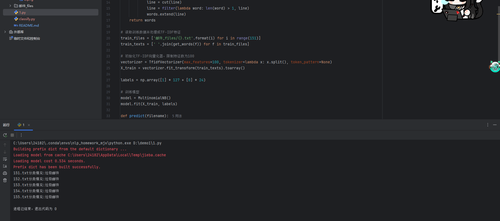
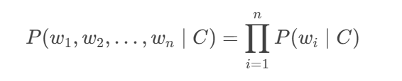
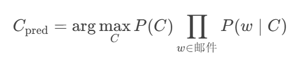
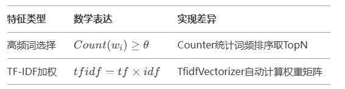
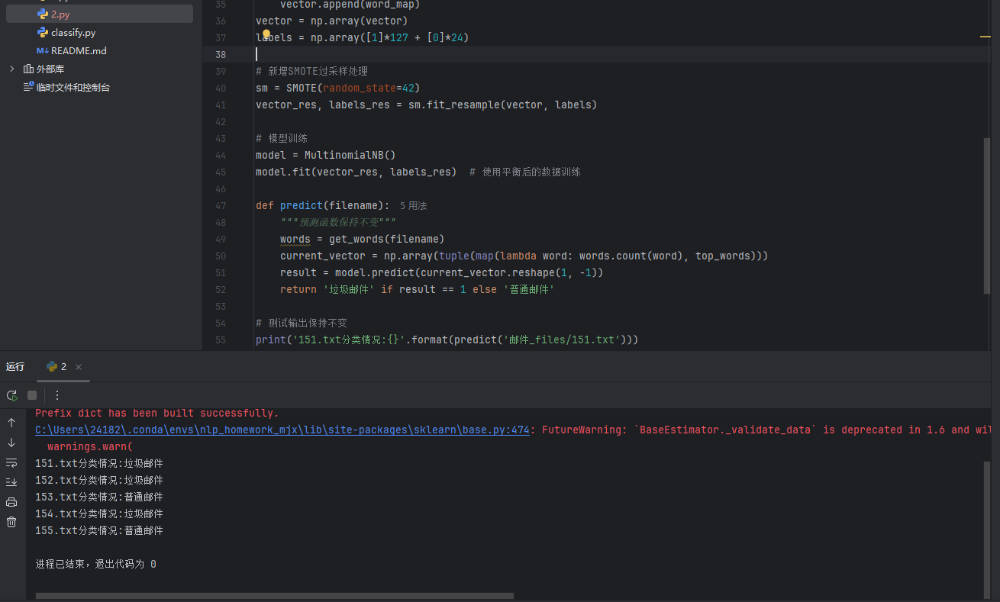
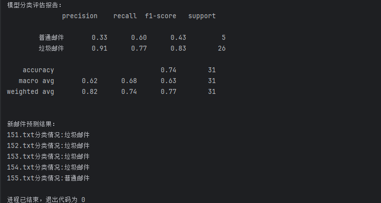

# Word2vec25问题

mask_index self.unk_index add_token
indices context 和 target mask_index
context的分词后的词数 target_df 和 target_size target 
sum vocabulary_size
DataLoader 训练模式 和 Dropout optimizer max
1e8 5 0
torch.cuda torch.cuda.is_available()
target_word eval()
0 embedding_size 减少
# 代码部署

# 优化特征选择方法

# 邮件分类项目

## 核心功能说明
本项目实现基于文本内容的邮件二分类（垃圾邮件/普通邮件），提供两种特征构建模式：
- 高频词特征选择模式
- TF-IDF特征加权模式

## 算法基础
### 多项式朴素贝叶斯分类器

## 算法基础：多项式朴素贝叶斯分类器
### 条件概率独立性假设
多项式朴素贝叶斯假设特征（如词项）在给定类别条件下是相互独立的。即：

其中 wi​ 表示词项，C表示类别。尽管现实中词项间存在关联，但这一简化假设显著降低了计算复杂度。

### 贝叶斯定理的应用形式
对于邮件分类任务，计算后验概率 P(C∣邮件内容)，选择最大概率的类别：

P(C)：类别的先验概率（训练集中类别占比）。
P(w∣C)：词项 ww 在类别 C 中的条件概率（通过词频统计 + 拉普拉斯平滑计算）。

## 数据处理流程
### 预处理步骤

1. 文件读取：读取UTF-8编码的文本文件
2. 无效字符过滤：正则表达式 [.【】0-9、——。，！~\*] 移除非文字字符
3. 中文分词：使用jieba进行精准模式分词
4. 停用词过滤：
   - 显式过滤：直接去除长度≤1的词语
   - 隐式过滤：通过后续特征选择实现
5. 文本标准化：转换为空格连接的分词字符串

## 特征构建流程
### 方法对比

## 高频词/TF-IDF两种特征模式的切换方法
### 切换为高频词模式：
#### 在特征提取部分修改为：
$(
from collections import Counter
def get_top_words(texts, top_n=100):
    all_words = chain(*[text.split() for text in texts])
    return [w for w,_ in Counter(all_words).most_common(top_n)]
top_words = get_top_words(train_texts)
vectorizer = CountVectorizer(vocabulary=top_words))$

### 切换为TF-IDF模式：
#### 在特征提取部分修改为：
$$(vectorizer = TfidfVectorizer(
    max_features=100,
    tokenizer=lambda x: x.split(),
    token_pattern=None
))$$

# 样本平衡处理

# 增加模型评估指标

